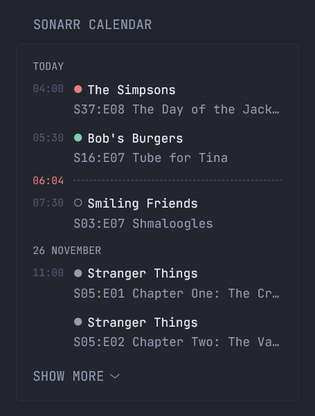

# Sonarr Calendar

Displays upcoming and recently added TV episodes from a Sonarr server in a compact calendar/list view.



## Usage

To use the Sonarr Calendar widget:

1. **Copy the `sonarr-calendar` folder** into your Glance widgets directory.
2. **Reference the widget** in your configuration file using `$include`:

```yml
widgets:
  - $include: widgets/sonarr-calendar/calendar.yml
```

## Options

| Option | Description | Default |
| --- | --- | --- |
| `api-base-url` | Required, Sonarr base URL, e.g. `http://sonarr:8989` |
| `api-key` | Required, Your Sonarr API key (Settings → General → Security) |
| `collapse-after` | Optional, number of items after which the list collapses | `5` |
| `start-day` | Optional, days offset from today to start the calendar |  `0` |
| `end-day` | Optional, days from today to include | `30` |
| `show-unmonitored` | Optional, `true` to include unmonitored episodes | `false` |